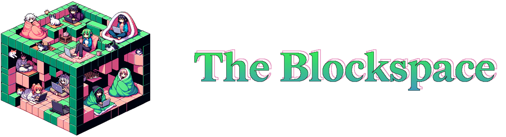

[​Zombienet](https://github.com/paritytech/zombienet) is an integration testing tool for parachain development teams. In this workshop, you'll use its basic functionality to launch your own local parachain network and learn about how connecting chains to Polkadot works under the hood.

## Learning objectives ✍️

- Learn about the big picture: relay chain binary and parachains, genesis config, executable
- Setup Zombienet locally
- Follow the steps to run the test net
- Launch networks with different configurations

## 📃 Workshop link

https://hackmd.io/@webzero/zombienet-workshop

## 🧑‍💻 Setup your environment

**Step 1: Clone this workshop repo 👇**

**Step 2: Make sure you have Zombienet installed 🧟‍♀️**

1. Download the binary from the [Zombienet releases page](https://github.com/paritytech/zombienet/releases) (macos or Linux).

1. Copy the binary into the root directory of your cloned repository.

Check it works by running:

```bash
./zombienet-macos -h
```

Now you're ready to get hacking ! 🚀

## 🎒 Workshop quests

> 🔎 To submit your proof of quest, simply clone this repo and make a PR to the `submissions` folder titled `Quest submission: {your name,} {date}` containing a short summary of the quests you've completed. Include screenshots if relevant and a reviewer will verify your submission.

Your proof of quest PR should create a new folder in the `submissions` folder with your name or pseudonym and contain:
1. A screenshot of your terminal after launching your network.
2. A screenshot of an on-chain state query of your choice using the Polkadot Developer Console.

Have a look at [this example](https://github.com/JoinWebZero/zombienet-workshop/pull/1) for reference.

Your workshop facilitator will provide you with a feedback form where, once you provide some feebdack, you can provide a link to your submission PR to be eligible for quest rewards. 😎
